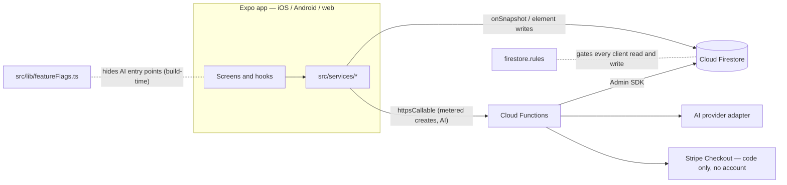

# Architecture

How B.O.A.R.D is built, for an engineer with five minutes. This is not a file
tour — the [docs index](docs/README.md) has the month-by-month record, and the
code's own headers carry the local reasoning.

## 1. Three toolchains, one repository

There are three TypeScript surfaces and they do not share a compiler config.
The Expo app (`app/`, `src/`) is checked by the root `tsc`. Cloud Functions
(`functions/`) is a separate npm project with its own lockfile, a Node 20
engine and a `tsc` build. The browser extension (`web/extension`) is plain JS
with no bundler, carrying a hand-ported copy of the pure logic it needs from
`src/lib/extension/`; the TypeScript originals are the tested ones and the
ports are kept in sync by hand. The root `tsconfig.json` excludes the other two
outright — they target different runtimes, Node against `firebase-admin` on one
side and an Expo bundle on the other. The direct consequence is that a type
error under `functions/` passes the root type-check and fails CI, which runs
three independent jobs: `build` (app type-check plus coverage), `rules-tests`
(emulator-backed, needs JDK 21) and `functions` (build plus test). A change
under `functions/` is not done until `npm run functions:build` is clean.

## 2. Request path, end to end

Screen → hook → `src/services/*Service.ts` → Firebase SDK. Live reads are
`onSnapshot` listeners; writes go to Firestore directly for element data
(strokes, shapes, text, notes) and through `httpsCallable` for anything the
free tier meters — board, session and workspace creation all leave the client
that way. `src/config/firebase.ts` is the only place the SDK is initialized,
resolving config from `EXPO_PUBLIC_FIREBASE_*` first and the committed dev
project in `app.json` second. The convention is that nothing outside
`src/services/` and `src/config/` imports `firebase/*`. Three files break it
today — `src/components/ShareBoardModal.tsx`, `src/contexts/AuthContext.tsx`
and `src/hooks/useBoardPresence.ts` each do a direct `getDoc` on a `users`
document, and `AuthContext` additionally subscribes to `onAuthStateChanged`.
They are listed here rather than hidden. Security is never in the client:
`firestore.rules` gates every read and write, and the callables re-check plan
and membership server-side regardless of what the UI showed.

## 3. The enforcement spine

`checkQuota()` in `src/services/quotaService.ts` is the UI's free-tier
pre-flight, warning before a create fails. It is not a gate, and the
file's first line says so: "ADVISORY ONLY — NOT AN ENFORCEMENT POINT." A
patched client or an authenticated REST write skips it. Month 5 moved every
metered create behind a callable. `createBoard` counts the workspace's live
boards and denies past the cap before writing; `createSession` writes the
session and bumps a monthly counter in one transaction — except for the
once-per-workspace onboarding session, which commits un-metered alongside its
marker; `createWorkspace` resolves entitlement across the workspaces the caller
owns. `firestore.rules` denies client creates outright for all three, and for
classes, so the callable is the only path, which makes
deploy order load-bearing: functions first, rules second, as that file's header
warns. The collaborator cap is the odd one out: joining by invite code is an
`update` to `members`, not a create, so no callable could cover it. It is a
rules predicate, kept equal to the TypeScript limits table by a drift test that
parses the rules text. The bypass test against a deployed backend is an unmet
gate: `functions/` has never been deployed.

## 4. Multi-tenancy

Every board and session belongs to a workspace. On the client,
`WorkspaceContext.activeWorkspaceId` scopes what the boards and sessions
surfaces list. In `firestore.rules`, board access resolves through the parent
workspace's membership, not the board's own `members` array alone. The
rules-test fixture includes a user named `evil` who is in a board's `members`
but not in that board's workspace; the `rules-tests` job asserts the workspace
gate denies them, and it is a hard CI gate rather than an advisory one. Legacy
documents with no `workspaceId` are still tolerated by the rules, so older
clients kept working through the rollout — with the known cost that the board
cap cannot count what it cannot see. The backfill migration exists and is
tested, and has never been run against real data.

## 5. The AI gateway

Every AI feature — session summaries, handwriting OCR, explain-selection,
text→diagram, flashcards, board Q&A — calls a Cloud Function. The functions
hold the provider key as a runtime secret, never in the client bundle; talk to
the model through one adapter, so the model is a config change; meter
calls, tokens and cost per workspace and per feature; rate-limit each workspace
with a token bucket (30-call burst, one token refilled every 30 s); and memoize
OCR and flashcard generation against a hash of the selected strokes, so a
re-run is free. Board Q&A embeds board content on write and retrieves with
Firestore's own `findNearest` vector search, so there is no second datastore.
Two honest caveats. The functions have never been deployed. And the pre-gateway
path is still in the tree as the default whenever the gateway flag is off: a
user-supplied OpenAI key, kept in the user's own Firestore document and cached
in device storage, used to call the provider from the client. Only summaries
have that fallback; the other five have no client path and are unavailable
while the flag is off. Removing it is a recorded open item, not a done one.

## 6. Feature flags

Every AI surface sits behind a build-time `EXPO_PUBLIC_*` variable in
`src/lib/featureFlags.ts`, each documented as Default OFF and inlined by Expo
at build time. Flipping one is a rebuild, not a restart. `AI_GATEWAY_ENABLED`
is the master: each feature's own "is this configured" check ands its flag with
that one, so the others are meaningless without it. Math and code elements are
the deliberate exceptions. `renderMath` is a callable, but MathJax runs
in-process with no provider, no key and no per-call spend; code elements
tokenize entirely client-side through shiki. Neither rides the gateway and
neither is metered against the workspace's AI quota. A flag hides an entry
point and nothing more — it is inlined into the client bundle and therefore
public and patchable, and none of the server-side checks in section 3 consult
it.

## 7. Diagram

