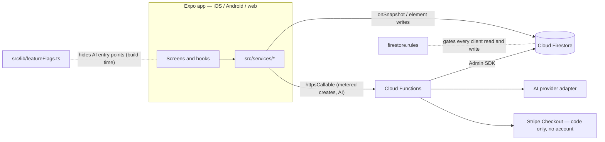

# B.O.A.R.D

Real-time collaborative whiteboard for study sessions — one Expo / React Native
codebase for iOS, Android and web, on Firebase, with server-enforced plan limits
and a metered AI gateway.

<!-- Demo badge slot. When a live demo exists, add one line here:
[](https://…) -->

<!-- Visual block — uncomment when docs/media/ is populated:

-->

> **Status.** Feature-complete through the roadmap's Month 6 and merged to `main`.
> **Not deployed:** the Cloud Functions have never been deployed, every AI flag
> defaults off, the Stripe integration has no account behind it, and there are no
> users. The [unmet gates](#unmet-gates) are listed below, not omitted.

## At a glance

Measured at commit `09afe01` with the commands in
[docs/README.md → Reproducing these numbers](docs/README.md#reproducing-these-numbers).

| | |
|---|---|
| TypeScript, including tests | 92,613 lines |
| App test suite | 130 suites / 2,018 tests · type-check clean |
| Cloud Functions suite | 31 suites / 739 tests |
| Security-rules suite (Firestore emulator) | 3 suites / 356 tests |
| Callable functions / Firestore triggers | 16 / 2 |
| Client service modules | 40 |
| `firestore.rules` | 1,427 lines |
| Built | March – September 2026, solo |

## The hard parts

**A client-side check is not a gate.** The first free-tier cap was `checkQuota()` in
the app, in front of a direct Firestore write. A patched client skips it, and the
file says so on its own first line. Board, class, session and workspace creation now
go through callables that count and write in one transaction, and `firestore.rules`
denies client creates for all four outright. The collaborator cap could not move the
same way: joining by invite code is an `update` to `members`, not a create, so no
callable covers it. It is a rules predicate instead, with a test that parses the
rules text to keep its numbers equal to the TypeScript limits table. The bypass test
against a deployed backend is an open gate — the functions have never been deployed.

**No provider key on the device — once the flag flips.** Every AI feature calls a
Cloud Function that holds the key as a runtime secret, meters calls, tokens and cost
per workspace and per feature, rate-limits with a token bucket, and memoizes OCR and
flashcard generation by a hash of the selected strokes. Each feature sits behind a
build-time flag, default off. The pre-gateway path — an OpenAI key the user supplies,
kept in their own Firestore document and cached in device storage — is still in the
tree as the default until the flags flip. Only session summaries have that fallback;
the other five AI features have no client path at all. Removing the legacy path is a
recorded open item, and saying so here is the point.

**Tenant isolation is a CI job, not a convention.** Boards resolve access through
their workspace, not through their own member list. The rules suite's fixture
includes a user who sits in a board's `members` but not in that board's workspace;
if the workspace gate stops denying them, the `rules-tests` job fails and the pull
request does not merge.

**The suite is one regex away from red.** Code elements tokenize with shiki
on-device, using its pure-JS engine because the default compiles Oniguruma to
WebAssembly that neither Jest nor Hermes can be assumed to load. shiki and the
unist/hast/micromark stack behind it are pure ESM, and jest-expo's transform never
matches `.mjs`. The root Jest config spreads the preset's transform, adds an `.mjs`
entry, and admits about twenty packages by prefix. Read its comments before touching
it.

## Stack

| Layer | |
|---|---|
| App | Expo SDK 55, React Native 0.83, React 19, expo-router, TypeScript 5.9 strict |
| Canvas | react-native-svg, custom hit-testing, R-tree spatial index |
| Backend | Cloud Firestore, Cloud Functions (Node 20), Firebase Auth, Storage |
| AI | Provider adapter over OpenAI; Google Vision for OCR; Firestore vector search |
| Billing | Stripe Checkout (code only — no account behind it) |
| Tests | Jest (app, functions), `@firebase/rules-unit-testing` on the emulator, GitHub Actions |



Read [ARCHITECTURE.md](ARCHITECTURE.md) for the request path, the enforcement
spine, tenancy, the gateway and the flags.

## Run it locally

Everything here runs with no backend of your own and no secrets.

```bash
npm ci
npx tsc --noEmit
npm test
```

The Cloud Functions are a separate npm project with their own lockfile:

```bash
npm --prefix functions ci
npm run functions:build
npm run functions:test
```

The security-rules suite runs against the Firestore emulator and needs JDK 21+:

```bash
npm run test:rules
```

To open the app itself, `npm start` (or `npm run web` / `android` / `ios`).

**About the backend.** The Firebase config committed in `app.json` is the author's
dev project. Signing up auto-creates a personal workspace through the
`createWorkspace` Cloud Function, and `firestore.rules` denies that create to
clients — so with the functions undeployed, the app loads but sign-up does not
complete. To run the whole product you need your own Firebase project with
`functions/` deployed; see [docs/functions-deploy-runbook.md](docs/functions-deploy-runbook.md).
The commands above need none of that.

## Unmet gates

1. The Cloud Functions have never been deployed, so nothing metered or AI-backed has
   run outside tests and the emulator.
2. Every AI flag defaults off, and the pre-gateway client-key path is still the
   default.
3. The Stripe checkout code has no Stripe account, product, price or webhook behind
   it.
4. The workspace migration has run against tests only, never production data.
5. The free-tier bypass test against a deployed backend has not been run.
6. Device and store verification carried from Month 2 — signed builds, push on
   hardware, mobile snapshot capture on a real Android — is open.
7. App Check: the client init exists behind `EXPO_PUBLIC_APPCHECK_SITE_KEY`; the app
   is not yet registered in the Firebase console.
8. Zero users.

## Features

Drawing with pressure-aware paths · shapes with recognition and snapping · text ·
sticky notes · voice notes · images · math and code elements · comments and
reactions · polls · templates · presence with live cursors · follow mode · scheduled
sessions with recaps and AI summaries · flashcards with SM-2 review · board Q&A over
Firestore vector search · workspaces and classes · shareable embeds · a browser
extension · an installable web build · deep links and a share-into-app receiver ·
friends and activity · board snapshots and export.

## Testing strategy

CI runs three independent jobs, because the repository holds three TypeScript
surfaces that share no compiler config. `build` type-checks the app and runs its
suite under a 60% line and statement floor scoped to `src/services/**`.
`rules-tests` boots the Firestore and Storage emulators and runs the security rules
against them. `functions` builds and tests the Cloud Functions project on its own
lockfile. A type error under `functions/` passes the root type-check and fails CI,
which is exactly why the jobs are separate.

The rules suite is the tenancy gate rather than a formality: cross-workspace
isolation is asserted there and nowhere else, so a regression in `firestore.rules`
fails the build rather than reaching a reader of the UI.

The coverage floor deliberately covers `src/services/**` only. That is where the
data access lives, and holding the whole tree to one number would have meant either
a meaningless threshold or tests written to satisfy it.

## Documentation

- [ARCHITECTURE.md](ARCHITECTURE.md) — toolchains, request path, enforcement spine,
  tenancy, the AI gateway, feature flags.
- [ROADMAP.md](ROADMAP.md) — the six-month plan, with per-month status and the
  corrections made along the way.
- [docs/](docs/README.md) — month-by-month phase plans, runbooks, and reference for
  builds, auth, deep linking and keyboard shortcuts.

## License

MIT — see [LICENSE](LICENSE).
